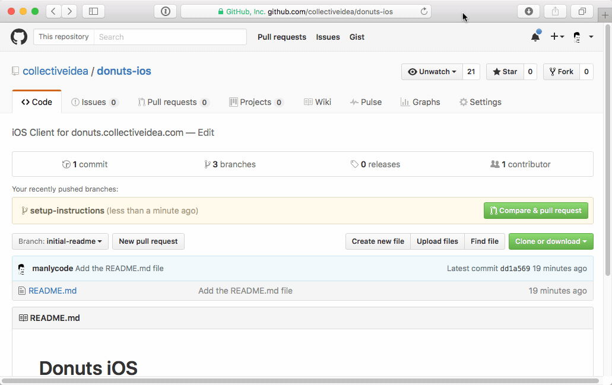

# Donuts iOS

### Create a GitHub Repository

We keep our code under source control. To begin on this project. I'll visit
GitHub and create a new repository.

Then in the terminal, I'll clone the empty repository as my starting point.

```bash
$ git clone https://github.com/collectiveidea/donuts-ios.git
```

To begin we'll want to add our initial commit. In this case it's a README.md file. The README.md file is important because it tells other developers on the team how to get started with the project. I'll add more instructional content here as we progress. It's the content a developer sees on the Github project page. For this project, you can see it at https://github.com/collectiveidea/donuts-ios.


Then I'll add a README.md file with a title.
```bash
$ echo "# Donuts iOS" > README.md
```

Then I'll commit these changes and push it to the remote repository.

```bash
$ git add .
$ git commit -m "Add the README.md file"
$ git push --set-upstream origin master
```

Now that we have our initial commit. It's time to add some actual content.

 We won't work off of `master`. That's where reviewed code goes. So, I'll cut a new feature branch named `setup-instructions` from master.

```bash
$ git checkout -b setup-instructions
```

Now I'm free to add instructional content for other developers

```bash
$ echo "## Building the Application\nOpen the Donuts-iOS.xcproj file, and press <&#8984;-R>" \
    >> README.md
```

After that, I'll commit the changes with a helpful message.

```bash
$ git add README.md
$ git commit -m "Add setup instructions."
$ git push --set-upstream origin setup-instructions
```

Then, I'll create a pull request so that another developer can review my committed
code.



Once that's approved and merged, I'll pull master and be ready to implement
the next feature.

```bash
$ git checkout master
$ git pull
```
#### Don't ignore the .gitignore file
It's important to start a project with a good _.gitignore_ file. Especially an
Xcode project. There are lots of files you want just for yourself and not the
rest of the team.

Here's an example of a standard Xcode .gitignore file [i] uses:
 ```
 .DS_Store

 build/
 DerivedData/

 *.hmap
 *.ipa
 *.dSYM.zip
 *.dSYM

 ## Playgrounds
 timeline.xctimeline
 playground.xcworkspace

 # Xcode

 build/
 *.pbxuser
 !default.pbxuser
 *.mode1v3
 !default.mode1v3
 *.mode2v3
 !default.mode2v3
 *.perspectivev3
 !default.perspectivev3
 xcuserdata
 *.xccheckout
 *.moved-aside
 DerivedData
 *.hmap
 *.ipa
 *.xcuserstate

 Carthage/
```
