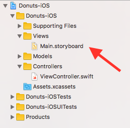
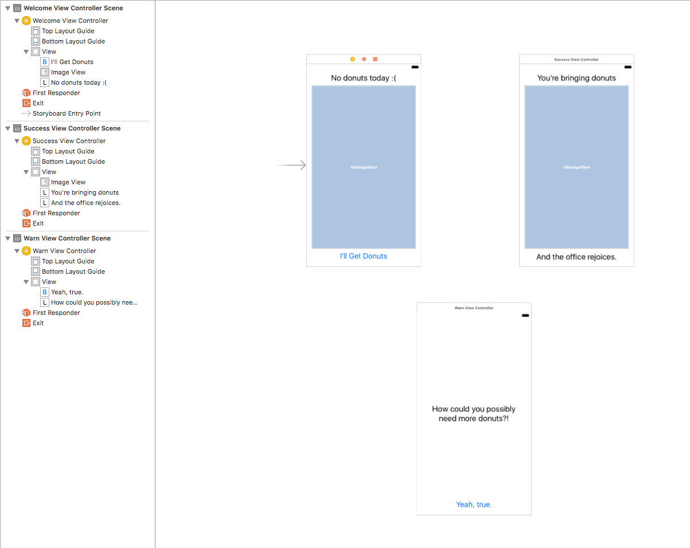
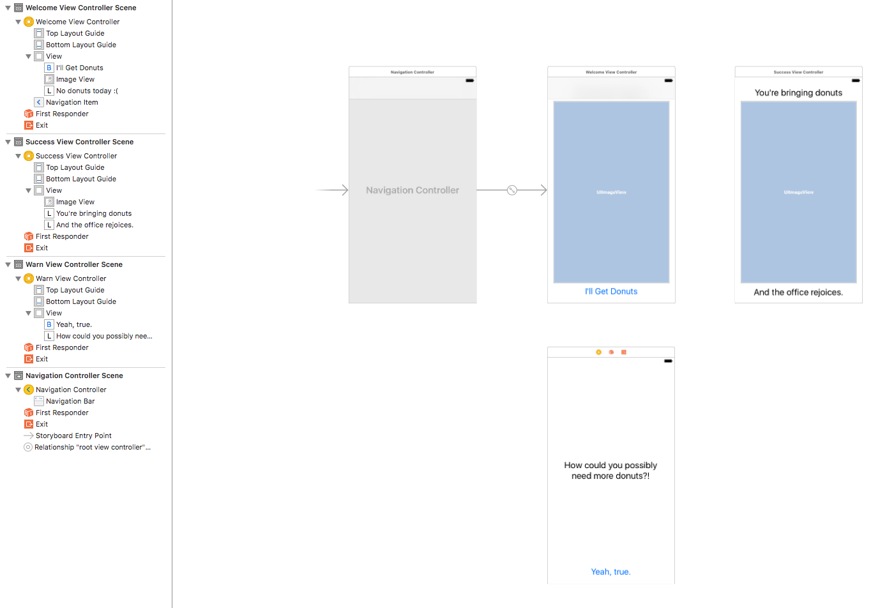
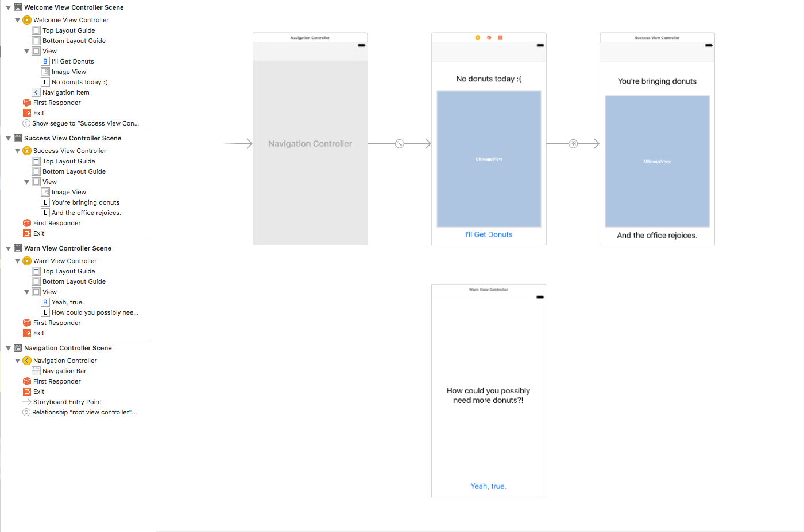

# HOW WE DEVELOP MOBILE APPLICATIONS - Part 3
## Fleshing out the App

### Outline
* Fleshing out the Storyboard
  * Build storyboard from http://collectiveidea.com/blog/archives/2016/11/04/how-we-develop-mobile-applications
  * Why do we start w/ an empty Storyboard
    * Because it gets the app idea in client's hands sooner
    * Sooner means better feedback
    * Failing faster means failing cheaper for Client

* Test driving the storyboard w/ Integration Tests
  * Why test the UI?
    * So we know when we break things
    * They will evolve over time

### Fleshing out the workflow
* Build from the reference wireframe in part 1
  * http://collectiveidea.com/blog/archives/2016/11/04/how-we-develop-mobile-applications
* Open up `Donuts-iOS/Views/Main.storyboard` 
  * Add "Welcome" screen
    * Rename `Donuts-iOS/Controllers/ViewController.swift` to `WelcomeViewController.swift`
    * Change class name to `WelcomeViewController.swift`
    * Change class used in Interface Builder to `WelcomeViewController`
    * Add UI Elements
      * Buton
      * ImageView
      * Label

  * Add "Success" screen
    * Add a "SuccessViewcontroller.swift file" in `Controllers`
    * Add the "SuccessViewcontroller" scene to the Storyboard
      * Use copy/paste
      * Change the scene's class
      * Change the content
  * Add "Warn" screen
    * Add a "WarnViewcontroller.swift" file in `Controllers`
    * Add the "WarnViewController" scene to the Storyboard
      * Use copy/paste
      * Change the scene's class
      * Change the content

  * Now the Storyboard should look like this 
  * Add Nav Controller to WelcomeViewController
    * Highlight "WelcomeViewController"
    * click "Editor > Embed in > Navigation Controller"
    * 

  * Link "Welcome" -> "Success"
    * Ctrl-drag from "I'll Get Donuts" button to "SuccessViewController"
      * Choose "Show segue"
  * Hand test in simulator
    * Adding the nav broke it!
      * It's important to hand-test

  * Re-adjust placement and run again.
    * 

### Writing tests around the workflow
