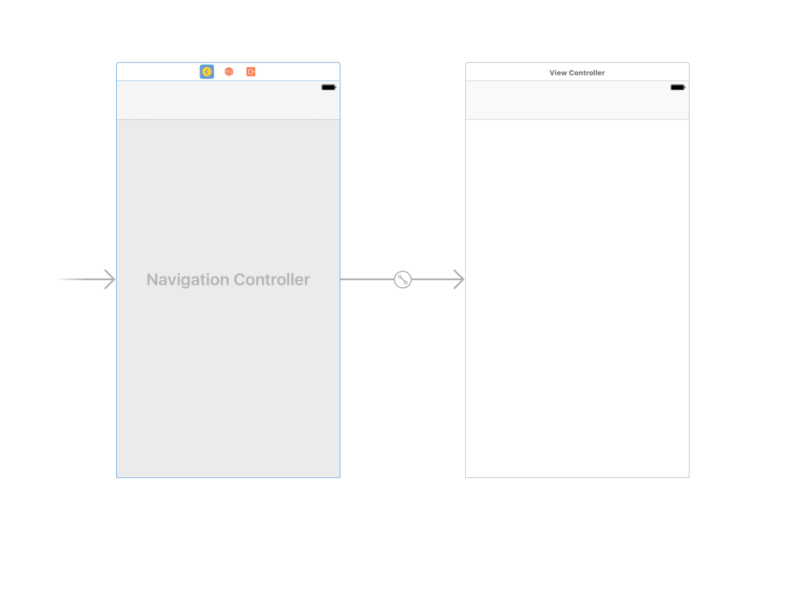
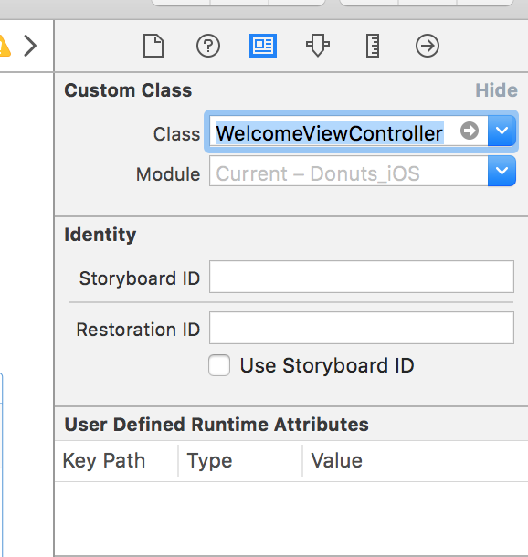
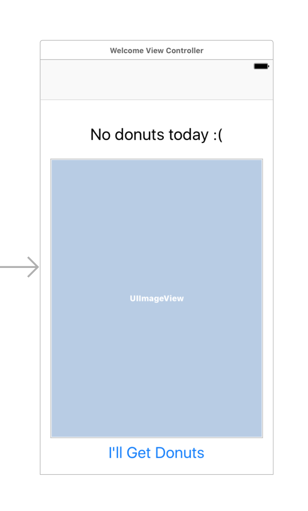
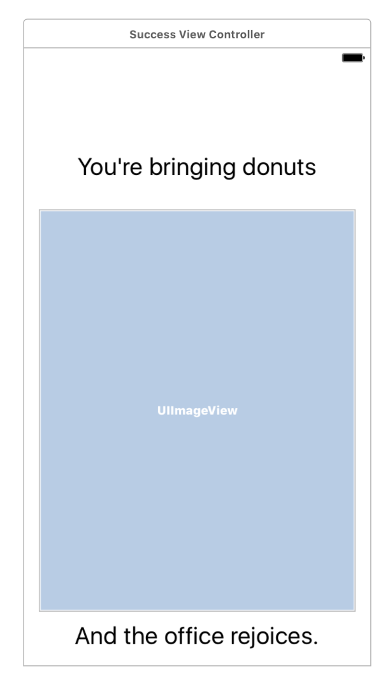
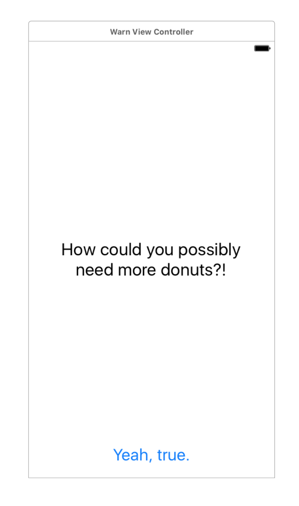

# HOW WE DEVELOP MOBILE APPLICATIONS - Part 3

Welcome back for the third post of our blog series on how we build mobile apps at Collective Idea. In the last installment we covered basic project setup. This time, we'll discuss our first steps in fleshing out the application.

## Fail Fast. Fail cheap.

Before we type a single line of code in our editor, we're going to check to see if the designs from [part 1](http://collectiveidea.com/blog/archives/2016/11/04/how-we-develop-mobile-applications) feel right, and help us achieve our goal (to communicate who's bringing donuts into the office).

We'll do that by building the storyboard, and hand-testing the application flow.

The purpose of this exercise is to see how our design feels. By hand-testing the application flow before code exists, we can tweak the application's design without the encumbrance of refactoring code. That's failing cheap.

If this were client work, we'd put this semi-functional prototype in their hand ASAP. That we can elicit feedback from them sooner rather than later. If we're building a product that's straying away from the client's vision, we can change course, and keep the project within its budget.

## Building From a Plan

To begin, check out the [part 1](http://collectiveidea.com/blog/archives/2016/11/04/how-we-develop-mobile-applications) wireframes. These wireframes tell us what we'll need to build.

The wireframes describe three distinct views. First, a *_Welcome_* view shows a user who's bringing donuts today, and allows the user to show that they're bringing donuts. The *_Success_* view shows the user that they communicated that they're bringing doughnuts. And finally, a *_Warn_* view notifies the user that there are already enough people bringing doughnuts.

## Fleshing Out the Storyboard

Open up the project in Xcode. Find the _Main.Storyboard_ in the project navigator and open that.

We'll use a Navigation controller to handle the application workflow for this prototype. Click on the _View Controller_ scene in the storyboard, then choose *Editor > Embed in > Navigation Controller* from the Interface Builder menu.

Now Interface Builder should look like this:

Now, find the file _Donuts-iOS/Controllers/ViewController.swift_ and rename it to _WelcomeViewController.swift_. Open its contents and change the class name to _WelcomeViewController_. Then finally, open _Main.Storyboard_, click on *View Controller* and change the class to _WelcomeViewController_.

Then, add the _WelcomeViewController's_ elements: a UIButton, UIImageView, and UILabel.

Click the _WelcomeViewController_ scene in the storyboard, then copy/paste it. The _Success_ scene uses a UILabel and UIImageView. Delete the UIButton, and the add a new UILabel at the bottom.

Add a new swift file in the _Controllers_ group named _SuccessViewController.swift_. Then change the class used by the _Success_ scene in the storyboard to _SuccessViewController_.

The last view we have to create is the _Warn_ view. Copy/paste the _WelcomeViewController_ onto the Storyboard. Remove the UIImageView, center the UILabelView, change its content, then change the UIButton's content. Add a _WarnViewController.swift_ file, and change the scene's class like we did with the other two views. It should now look something like this.

## Connecting the Scenes

Our prototype is nearly done, but it's still disjointed. We'll add a segue to give some behavior.

Press _Ctrl_ click the "I'll Get Donuts" button and drag your cursor to the _Success View Controller_. Choose _Show_ from the _Action Segue_ popover.

## Trying it Out

Now we can try the app out. Plug in your device, and press _Command-R_. Note what you like, change what you don't like. Put it in other people's hands and see what they thing. Then, iterate until the app feels right.
